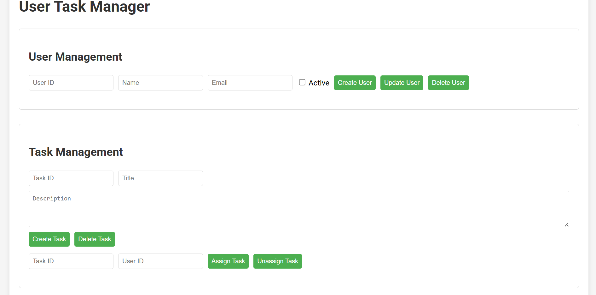
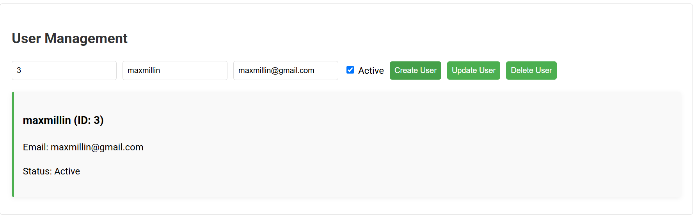
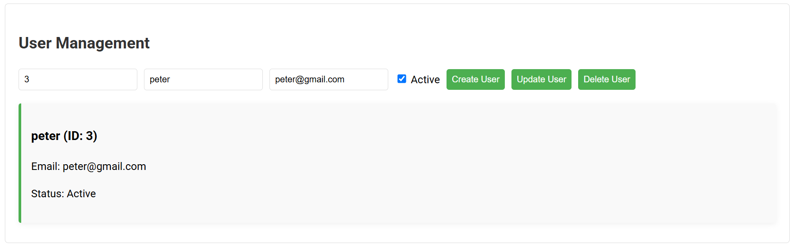
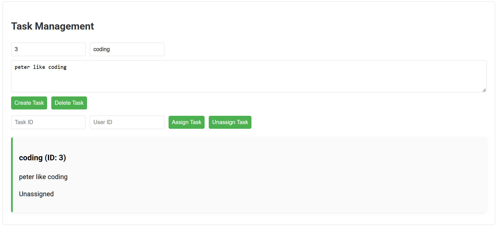
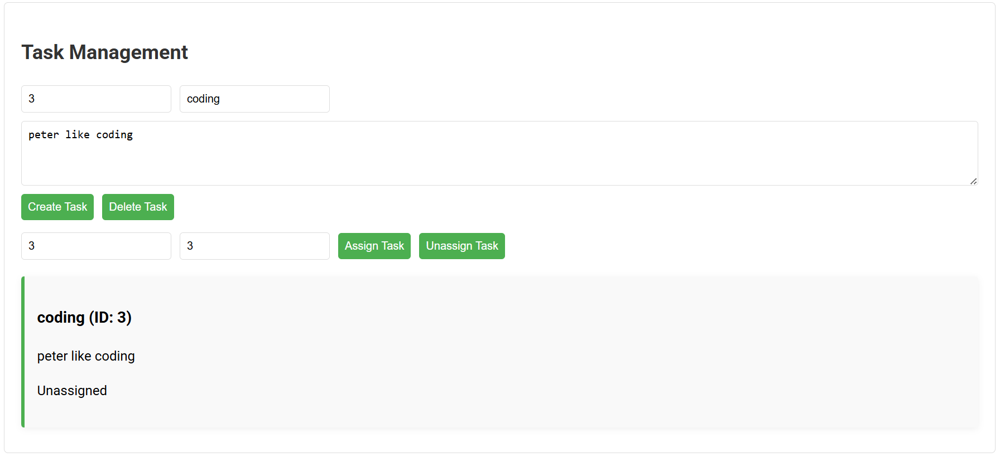

# User Task Manager (myproject)



## Description

User Task Manager is a simple TypeScript-based web application for managing users and tasks. It allows you to create, update, and delete users and tasks, as well as assign and unassign tasks to users. The app features a dynamic user interface that updates in real-time as changes are made.

## Features

- User management: create, update, and delete users
- Task management: create and delete tasks
- Task assignment: assign and unassign tasks to users
- Dynamic UI updates to reflect current users and tasks
- Simple and clean web interface

## Installation

1. Clone the repository:

   ```bash
   git clone https://github.com/Maxmillian-Muiruri/user-management-typescript.git
   cd user-management-typescript
   ```

2. Install dependencies:

   ```bash
   npm install
   ```

3. Run the development server:
   ```bash
   npm run dev
   ```

## Usage

- Use the **User Management** section to add new users by entering a user ID, name, email, and active status, then click "Create User".

  

- Update or delete existing users by entering their ID and the updated information, then clicking "Update User" or "Delete User".

  

- Use the **Task Management** section to create new tasks by entering a task ID, title, and description, then click "Create Task".

  

- Delete tasks by entering the task ID and clicking "Delete Task".

- Assign tasks to users by entering the task ID and user ID, then clicking "Assign Task".

  

- Unassign tasks by entering the task ID and clicking "Unassign Task".

  

- The lists of users and tasks are displayed below each section and update automatically.

## Build

To build the project for production, run:

```bash
npm run build
```

This will compile the TypeScript files into JavaScript in the `dist` directory.

## Repository and License

- Repository: [https://github.com/Maxmillian-Muiruri/user-management-typescript](https://github.com/Maxmillian-Muiruri/user-management-typescript)
